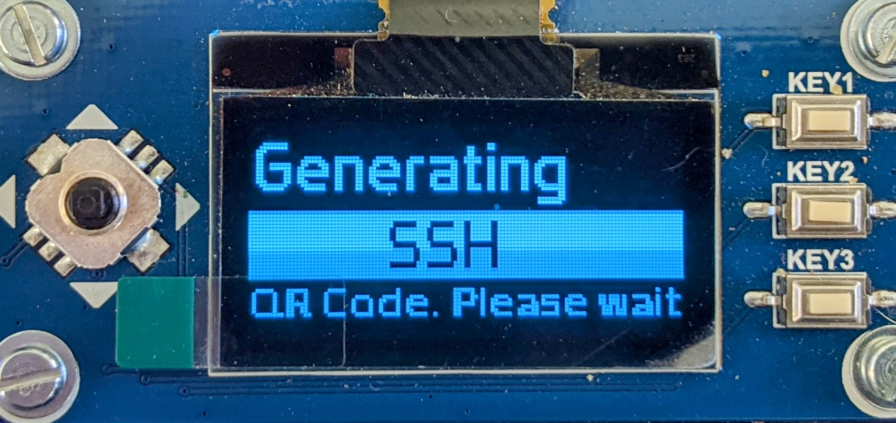
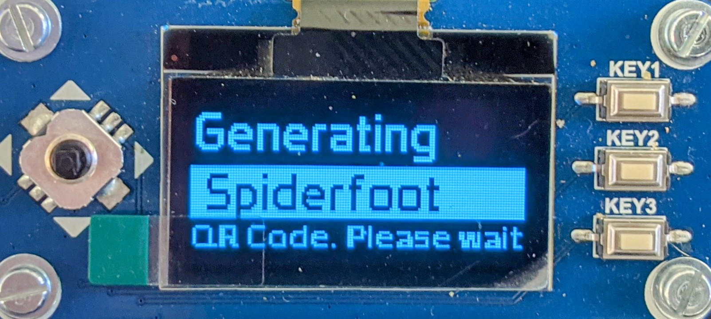
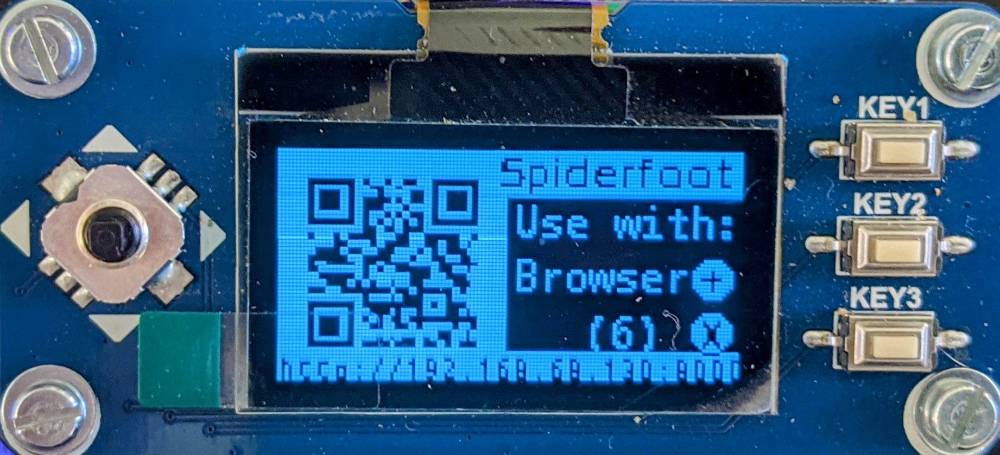
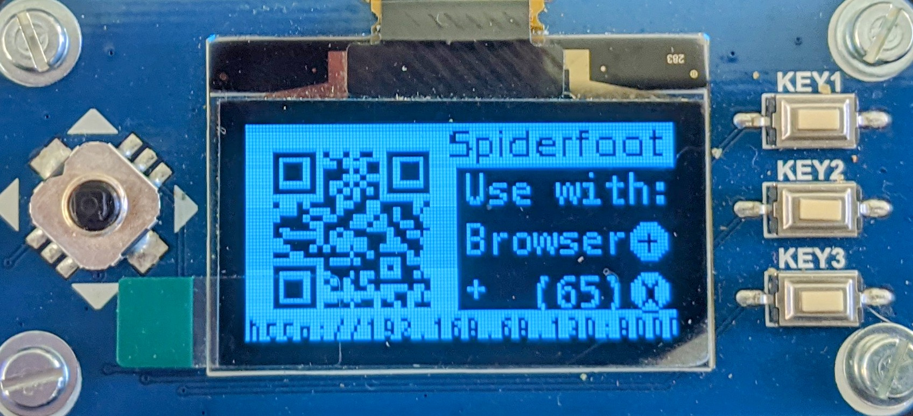

# ♟️ Display QR Codes on P4wnP1 (<code>p4wnsolo-qr</code>)
🟢 QR Code display for P4wnP1 w/OLED (SSH, VNC, P4wnP1 WebGUI, any text / URL / exfiltrated data)

Note:  The script currently checks the WiFi (Client-mode) IP Address.  I didn't add other IP addresses in yet (such as Ethernet Gadget IP Address, etc) because this is a work-in-progress, and the current version is more of a demo than anything.

* This script package gives your P4wnP1 w/OLED screen the ability to generate and display QR Codes directly on the OLED screen.
The intented purpose is to run this script when P4wnP1 boot up (see below for How to Run on Boot instructions).

* This way you can see your P4wnP1's IP address automatically (and scan the QR Code with a phone) after P4wnP1 boots up, without having to do anything else.
Ideally, this method of displaying (and optionally scanning) would save time in your workflow and make on-the-go operations faster & more plausible.

* Additionally, I hope to add this into BeBoXGui / p4wnsolo-dashboard as a core component in a group of OLED display scripts.

Now for the real stuff:

#### Example of P4wnP1 showing QR Code to connect to Raspberry Pi via SSH:

## Requirements:
##### 🔵 Raspberry Pi Zero W / Zero 2 (tested Dec 12, 2021 on RPi 0 W running P4wnP1 ALOA)
##### 🔵 1.3" OLED Hat (SH1106)
##### 🔵 <a href="https://osintool.com/sh1106-oled-screen/">Luma.oled drivers installed</a>
##### Install Luma & Luma OLED:
##### <a href="https://github.com/pimoroni/sh1106-python"><code>sudo pip3 install luma luma.oled</code></a>

## 🔨 Usage:
##### Clone the repo
<code>git clone https://github.com/p4wnsolo/p4wnsolo-qr.git</code>
##### Change directories
<code>cd p4wnsolo-qr</code>
##### Launch the script
<code>python3 p4wnsolo-qr.py -i spi --display sh1106</code>

## 🚀 Optional:  Start on Boot
First, we run this command to open the crontab edit screen:
<code>crontab -e</code>
Then move the cursor to the first empty line and Paste this:
<code>@reboot sudo /usr/bin/python3 /root/p4wnsolo-qr.py &&
Just run a quick test to verify p4wnsolo-qr.py is actually in the filepath above (or change the line above).
####How do I test the crontab entry before I reboot?
Test the crontab entry by running the command above (without the "@reboot" part or "&&" part) in the Command Line before rebooting.  Ex:
<code>sudo /usr/bin/python3 /path/to/file/p4wnsolo-qr.py</code>
Note:  If your OLED screen is already displaying something using Python, you'll have to kill that script before running P4wnSolo-QR so they don't fight for screen access:
<code>pkill -f "yourScriptNameHere.py"</code>
  
### 📷 Sample QR Code:

See the images in this Repo (<code>p4wnsolo-qr-code-XYZ.jpg</code>) or scroll down for example display screens.

#### 🕷Extra:
The default operating mode is <code>ssh</code>, which generates a QR Code to connect to Raspberry Pi via SSH.
There's also a <code>spiderfoot</code> option, which generates a QR Code to connect to Spiderfoot server running on Raspberry Pi.
The Spiderfoot feature has not yet been implemented (doesn't check to see if Spiderfoot is running).
But if you want to see the "demo" of Spiderfoot QR Code mode, here's how:
1.  Open <code>p4wnsolo-qr.py</code> in text editor
2.  Near Line 25, you'll see something like this:  <code>##### Set mode here</code>
3.  Comment out the line that says <code>themode = 'ssh'</code>
4.  Uncomment the line that says <code>themode = 'spiderfoot'</code>
In the works:
- Add <code>themode<code> code entries for P4wnP1 WebGUI URL
  
## 📷 Screenshots
  
### Generating QR Code for SSH

  
### Displaying QR Code for SSH

  
### Generating QR Code for Spiderfoot

     
### Displaying QR Code for Spiderfoot

  
### After Pressing + Button for More Time
  

  
## File Requirements
  #####These Files Must Be in the Same Folder as <code>p4wnsolo-qr.py</code>:
  * DroidSansMono.ttf - Font for small text on OLED screens
  * Prototype.ttf - Font for "Generating QR Code" screen
  * SH1106.py - Library for displaying things on SH1106 OLED screen
  * SH1106.pyc - Config file for ^
  * config.py - Config file
  * config.pyc - Config file
  * demo_opts.py - Config file
  
  
  
  
Thanks to
  BeBoX
  Rogan.Dawes
  MaMe82
for the excellent work and inspiration
